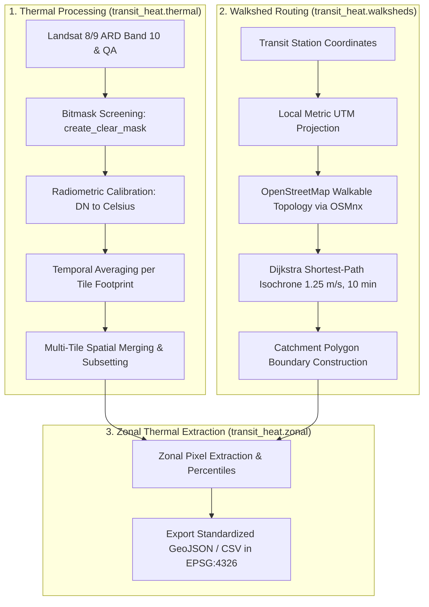

# Transit Stations Heat Exposure Analysis

[](https://www.python.org/downloads/)
[](https://opensource.org/licenses/MIT)
[](https://pep8.org/)

An urban environmental and transit equity research pipeline analyzing pedestrian-scale thermal exposure across rapid transit station walksheds in **New York City (MTA)**, **Chicago (CTA)**, and **Washington, D.C. (WMATA)**.

This repository provides a modular, reproducible Python package for:
1. **Satellite Thermal Radiometry**: Calibrating Landsat 8/9 Level-2 Surface Temperature (Band 10), bitmask filtering with pixel quality assessment (`QA_PIXEL`), temporal averaging, and spatial scene stitching.
2. **Graph-Theoretic Pedestrian Network Walksheds**: Delineating realistic 10-minute pedestrian walking catchments ($750\text{ m}$ reachable distance at $1.25\text{ m/s}$) along OpenStreetMap navigable topologies via OSMnx.
3. **Zonal Microclimatic Extraction**: Computing microclimatic surface temperature statistical distributions (median, mean, min, max, std, IQR, 10th, 25th, 75th, 90th, and 99th percentiles) across station walksheds.

---

## 1. Methodology & Pipeline Architecture



### 1.1. Physical Radiometric Calibration & QA Bitmasking
Landsat Collection 2 Level-2 Surface Temperature Digital Numbers ($\text{DN}$) are calibrated to kinetic temperature in degrees Celsius ($^\circ\text{C}$) via:

$$T(^\circ\text{C}) = (\text{DN} \times 0.00341802 + 149.0) - 273.15$$

Clear-sky terrestrial pixels are screened using 16-bit bitwise evaluation on `QA_PIXEL` to filter out:
- Dilated cloud (Bit 1), Cirrus (Bit 2), Cloud (Bit 3), Cloud Shadow (Bit 4), Snow/Ice (Bit 5), and Surface Water Bodies (Bit 7).
- High-confidence flags for cloud, shadow, and cirrus contamination (Bits 8–15).

### 1.2. Metric Walkshed Parameterization
Traversability across OpenStreetMap pedestrian networks is parameterized using standardized urban transportation engineering benchmarks:
- **Walking Speed ($v$)**: $1.25\text{ m/s}$ ($4.50\text{ km/h}$, $2.80\text{ mph}$).
- **Travel Time ($t$)**: $10\text{ minutes} = 600\text{ seconds}$.
- **Reachable Network Distance ($d$)**: $1.25\text{ m/s} \times 600\text{ s} = 750\text{ meters}$.
- **Metric Projections**: Local UTM Zone 18N (`EPSG:32618`) for NYC and DC; UTM Zone 16N (`EPSG:32616`) for Chicago.

---

## 2. Repository Structure

```text
Transit-Stations-Heat/
├── transit_heat/
│   ├── __init__.py           # Package exports & version
│   ├── config.py             # Spatial CRS, calibration constants, QA bit flags
│   ├── thermal.py            # Landsat LST calibration, QA bitmasking, compositing, stitching
│   ├── walksheds.py          # OSMnx network extraction, Dijkstra 10-min isochrone routing
│   ├── zonal.py              # Zonal statistics calculation linking LST with walksheds
│   └── pipeline.py           # Multi-city pipeline orchestrator
├── main.py                   # Main CLI entrypoint
├── pyproject.toml            # Package build configuration (PEP 517/621)
├── environment.yml           # Conda environment specification
├── requirements.txt          # Pip dependencies
├── .gitignore                # Git ignore rules for data, cache, and scratch files
├── LICENSE                   # MIT License
└── README.md                 # Project documentation
```

---

## 3. Installation

### Option A: Conda / Mamba (Recommended)
```bash
# Clone the repository
git clone https://github.com/your-username/Transit-Stations-Heat.git
cd Transit-Stations-Heat

# Create and activate environment
conda env create -f environment.yml
conda activate transit-heat
```

### Option B: Pip & Virtual Environment
```bash
python -m venv venv
source venv/bin/activate  # On Windows: .\venv\Scripts\activate
pip install -r requirements.txt
```

---

## 4. Usage & Execution

### 4.1. Command-Line Interface (CLI)
The root script [`main.py`](./main.py) provides a flexible command-line interface:

```bash
# Execute the full pipeline for all three cities (NYC, Chicago, DC):
python main.py

# Run only the walkshed network routing stage for Chicago and DC:
python main.py --cities Chicago DC --stage walksheds

# Run only zonal temperature extraction on existing walkshed polygons:
python main.py --cities NYC --stage zonal

# Custom pedestrian velocity (1.35 m/s) and travel duration (15 minutes):
python main.py --walk-speed 1.35 --walk-time 15
```

### 4.2. Python API
You can also import and use the modular classes directly in your Python workflows:

```python
import geopandas as gpd
from transit_heat import WalkshedGenerator, ZonalExtractor, ThermalProcessor

# 1. Load station locations
generator = WalkshedGenerator(walk_speed_mps=1.25, trip_time_seconds=600)
stations = generator.load_stations("metrolocs/DC.geojson", city_name="DC")

# 2. Generate 10-minute pedestrian walkshed polygons
walksheds = generator.generate_city_walksheds(stations, city_name="DC")

# 3. Extract zonal surface temperature percentiles from calibrated LST GeoTIFF
extractor = ZonalExtractor()
stats_gdf = extractor.process_city_zonal_stats(
    walksheds_gdf=walksheds,
    temperature_raster_path="stitched_city_temperatures/DC_subset_surface_temperature.tif"
)

# 4. Export standardized GeoJSON in EPSG:4326
extractor.export_statistics(stats_gdf, "station_temperature_statistics_dc.geojson")
```

---

## 5. Output Data Schema

Primary exported GeoJSON feature collections contain the following attributes:

| Field Name | Type | Units | Description |
| :--- | :--- | :--- | :--- |
| `city` | String | Dimensionless | Metropolitan network (`NYC`, `Chicago`, `DC`) |
| `station_name` | String | Dimensionless | Standardized transit station name |
| `walk_time_minutes` | Integer | Minutes | Catchment threshold ($10\text{ min}$) |
| `walk_speed_mps` | Float | m/s | Pedestrian walking velocity ($1.25\text{ m/s}$) |
| `area_km2` | Float | $\text{km}^2$ | Enclosed walkshed polygon land area |
| `median_temp` | Float | $^\circ\text{C}$ | Median walkshed Land Surface Temperature |
| `mean_temp` | Float | $^\circ\text{C}$ | Mean walkshed Land Surface Temperature |
| `min_temp` / `max_temp` | Float | $^\circ\text{C}$ | Minimum / Maximum walkshed temperature |
| `temp_25th` / `temp_75th`| Float | $^\circ\text{C}$ | 25th (Q1) and 75th (Q3) temperature percentiles |
| `temp_10th` / `temp_90th`| Float | $^\circ\text{C}$ | 10th and 90th temperature percentiles |
| `temp_99th` | Float | $^\circ\text{C}$ | 99th percentile extreme heat exposure |
| `pixel_count` | Integer | Count | Number of valid 30m Landsat clear-sky pixels |
| `geometry` | Polygon | EPSG:4326 | Standardized WGS84 walkshed boundary |

---

## 6. Contributing & License

Contributions, issue reports, and pull requests are welcome. This project is licensed under the [MIT License](./LICENSE).
